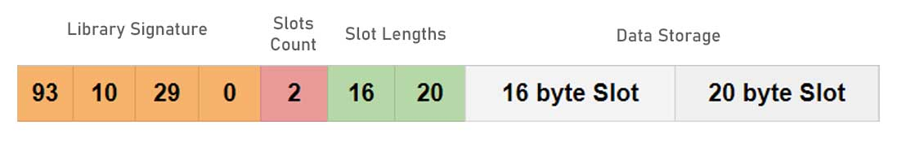

# ii_ROM Library for EEPROM Management

The ii_ROM library is designed for efficient and structured data storage in the EEPROM of ESP32 microcontrollers. It provides an easy-to-use interface for storing and retrieving data, suitable for a variety of applications that require persistent data storage.

#### EEPROM Memory Layout for `ii_ROM` Library

The `ii_ROM` library organizes the EEPROM memory in a structured manner for efficient data management:

```cpp
//example
  rom.begin(2, 4096); // Initialize with 2 slots and 4096 bytes of EEPROM.
  rom.createSlot(0, 16); // Create a slot at index 0 with length 16 bytes.
  rom.createSlot(1, 20); // Create a slot at index 1 with length 20 bytes.
```
   

| Library Signature | Slots Count |
| ----------------- | ----------- |
| **Bytes 0-3**: Reserved for the library signature (`{93, 10, 29, 0}`). This signature is used to identify that the EEPROM is formatted and managed by the `ii_ROM` library. <br> **Purpose**: Helps the library verify that the EEPROM is initialized and managed by `ii_ROM`. | **Byte 4**: Stores the count of data slots created in the EEPROM. <br> **Purpose**: Indicates how many data slots are defined, allowing the library to manage each slot effectively. |

| Slot Lengths | Data Storage |
| ------------ | ------------ |
| **Following Bytes (Starting from Byte 5)**: Each byte here represents the length of a corresponding data slot. The number of these bytes is equal to the slots count defined in the previous section. <br> **Purpose**: Defines the size of each data slot, enabling the library to locate and manage data efficiently. | **After Slot Lengths**: The actual data for each slot is stored sequentially. <br> **Purpose**: Provides structured storage for user data, ensuring data is stored and retrieved correctly. |


## Key Features:

1. **Structured Data Storage**: Organize data in slots for easy management and retrieval.
2. **Flexible Data Types**: Support for various data types, including strings and byte arrays.
3. **Efficient Memory Usage**: Optimize EEPROM usage with dynamic allocation and deallocation.
4. **Data Integrity**: Functions to check if slots are empty and to validate data integrity.
5. **Easy Data Manipulation**: Simplified API for reading, writing, and clearing data.
6. **Debugging Support**: Functions to print and inspect EEPROM data for troubleshooting.

## Use Cases:

- **Device Configuration**: Store device settings and preferences persistently.
- **User Data Management**: Keep user-specific data like credentials, profiles, or preferences.
- **System Logging**: Maintain logs or records that persist across reboots.
- **Educational Projects**: Teach EEPROM management and data storage concepts.

 
## Getting Started:

Include the `ii_ROM.h` header in your Arduino sketch and initialize the library as shown in the examples. Customize the slot structure as per your application's requirements.

```cpp
#include <ii_ROM.h>
```

### Installation for Arduino IDE

1. **Download the Library**:
   - Go to the `ii_ROM` GitHub repository and download the ZIP.
2. **Install in Arduino IDE**:
   - Open Arduino IDE, go to `Sketch` > `Include Library` > `Add .ZIP Library...`, and select the downloaded file.
3. **Include the Library**:
   - In your sketch, go to `Sketch` > `Include Library` and select `ii_ROM`.

### Installation for PlatformIO

Add `ii_ROM` as a dependency in your `platformio.ini` file, or manually copy the library into your project's `lib` directory.

Certainly! I will add detailed descriptions of example sketches to the `ii_ROM` library's `README.md`. These descriptions will provide users with an understanding of what each example demonstrates:

 
## Example Sketches

Below is a list of the example sketches available for the `ii_ROM` library. Click on an example to view the source code.

- [`Basic Read and Write`](examples/rom_01_simple_read_write.ino) - Demonstrates basic read and write operations to the EEPROM.

    ```cpp
    #include <ii_ROM.h>

    ii_ROM rom; // Create an instance of the ii_ROM class.

    void setup()
    {
    // Initialize the ROM with a specific data length and EEPROM size.
    // This configuration depends on your specific hardware and requirements.
    rom.begin(10, 4096);

    // Create a slot in ROM to store data.
    // Slot index is set to 0 and the length of data to be stored is defined.
    rom.createSlot(0, 10);

    // Writing data to the slot.
    // Here, we're writing a simple string to slot 0.
    rom.write("Hello, ROM", 0);

    // Reading and printing data from the slot.
    // The data read from slot 0 is printed to the serial monitor.
    String data = rom.read(0);
    Serial.println(data);
    }

    void loop()
    {
    // Regular operations or additional functionality can be added here.
    }
    ```

- [`Multiple Read and Write`](examples/rom_02_multiple_read_write.ino) - Shows handling of multiple data slots, useful for managing different types of data.
- [`Advanced Data Handling`](examples/rom_03_multi_data_functions.ino) - Explores complex operations including handling of various data structures and types.
- [`Data Integrity and Validation`](examples/rom_04_advanced_operations.ino) - Focuses on ensuring the integrity of data in EEPROM, including checks for empty slots.
- [`Efficient Memory Utilization`](examples/rom_05_advanced_features.ino) - Illustrates advanced features like optimizing memory usage and dynamically managing data.

Each example is designed to provide insights into specific aspects of EEPROM management using the `ii_ROM` library, aiding in both learning and practical application.

---

## Contributing
Contributions to improve and enhance the `ii_ROM` library are welcome. Feel free to fork the repository, make changes, and submit pull requests.

## License

The ii_ROM library is licensed under the LGPL-3.0. See the [LICENSE](LICENSE) file for details.

